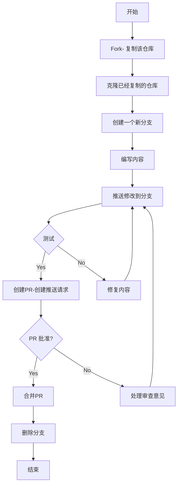

# 如何向他人的项目提交内容？

## 一、什么是 GitHub？

**GitHub** 是目前全球最流行的 **代码托管平台**，基于 **Git 版本控制系统**。

- 成立于 2008 年，2018 年被 **Microsoft 收购**。
- 主要用于 **开源项目托管** 和 **协作开发**。
- 除了代码托管，它还提供了 **协作工具、CI/CD、项目管理** 等功能。

一句话总结：GitHub 就是 **程序员的“社交平台”+“代码仓库”**。

------

## 二、GitHub 的主要功能

1. **代码托管**
   - 支持公共（开源）和私有仓库
   - 提供分支、合并、Pull Request（PR）功能
   - 代码浏览、版本回溯、历史记录
2. **协作开发**
   - Pull Request（贡献代码的标准流程）
   - Issues（问题/需求跟踪）
   - Discussions（社区讨论区）
   - Wiki（项目文档）
3. **CI/CD**
   - **GitHub Actions**：可以自动化测试、构建、部署
   - 工作流文件 `.github/workflows/xxx.yml`
4. **项目管理**
   - Projects（看板式管理，类似 Trello）
   - 任务分配、里程碑
5. **社区生态**
   - 全球最大的开源社区，拥有数千万开发者
   - 丰富的开源项目、模板、学习资源

------

## 三、GitHub 的优势

- **全球最大开源社区**：大多数开源项目首选 GitHub 托管。
- **协作能力强**：Pull Request + Code Review 是标准化的开源协作模式。
- **GitHub Actions 自动化**：支持 CI/CD、自动部署。
- **与 Microsoft/Azure 集成**：云端支持更完善。

------

## 四、GitHub 的基本使用

### 1. 注册与创建仓库

- 在 [github.com](https://github.com) 注册账号
- 点击 **New repository** → 填写仓库名、选择公有/私有 → 创建

### 2. 基本 Git 命令（配合 GitHub 使用）

```
# 克隆远程仓库到本地
git clone https://github.com/用户名/仓库名.git  

# 添加文件
git add 文件名  

# 提交代码
git commit -m "提交说明"  

# 推送到远程 GitHub 仓库
git push origin main  

# 拉取远程最新代码
git pull origin main
```

### 3. 协作开发流程（以 Pull Request 为例）

1. Fork 别人的仓库
2. 修改代码并提交到自己的分支
3. 发起 Pull Request (PR) → 等待作者 Review
4. 通过后合并到主仓库

### 4. GitHub Actions（简单示例）

在仓库中新建 `.github/workflows/ci.yml`：

```
name: CI
on: [push]
jobs:
  build:
    runs-on: ubuntu-latest
    steps:
      - uses: actions/checkout@v3
      - name: Run a one-line script
        run: echo "Hello GitHub Actions!"
```

这样，每次 push 代码时都会执行这个工作流。

------

## 五、GitHub 与 GitLab 对比（简表）

| 特点     | GitHub                     | GitLab                 |
| -------- | -------------------------- | ---------------------- |
| 定位     | 代码托管 + 开源协作社区    | DevOps 一体化平台      |
| 部署方式 | 主要云端，企业版可私有部署 | 开源 + 可私有部署      |
| CI/CD    | GitHub Actions             | GitLab CI/CD（更强大） |
| 社区规模 | 全球最大开源社区           | 开源企业用户更多       |



## 六、 Fxxk 它

1. 进入你想参与的项目，点击右上角的 Fork


2. 之后会引导你创建一个属于你个人的一个仓库。
3. 创建完成之后，你可以在自己的仓库目录下看到你想参与的项目。


## 七、修改内容

接下来你可以将项目克隆到本地进行编辑修改，然后提交。这些内容在 Git 基础学习中已经阐述了，可以参考页头的流程图进行相应操作。

## 八、推送请求

> **Note**
>
> 推送前一定要多次验证

推送请求有两个方式：

1.再回到你 Fork 仓库项目目录，点击 `commit ahead`，会跳转到源项目，点击创建一个PR（create pull request），填写提交说明并提交，之后就是等待项目管理人员审核你的提交，审核通过或者不通过都会给你发消息。


2. 直接进入源仓库目录，点击目录上方的 `Pull requests`，按照引导完成提交。